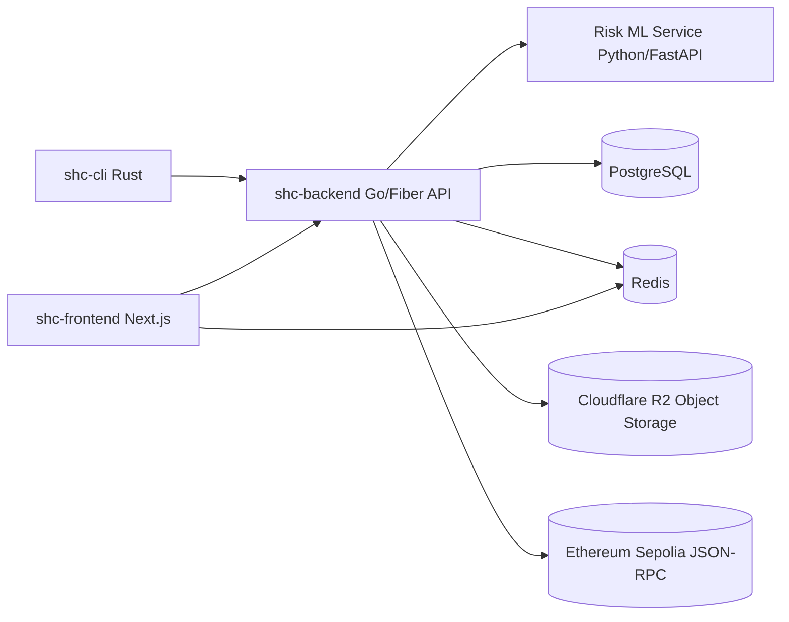

# 1. Project Title

## SHC Monorepo

SHC is a full-stack file sharing platform with three deliverables in one repository:

- `shc-backend`: Go API for authentication, file metadata, quotas, and storage URL generation
- `shc-frontend`: Next.js web app for browser-based file management
- `shc-cli`: Rust command-line tool for terminal-first file operations
- `shc-risk-ml-service`: Python ML microservice for risk scoring and threat explanations

---

# 2. Project Overview

SHC solves a common problem: securely sharing files from both a web interface and a command-line workflow while keeping infrastructure scalable and cost-aware.

Instead of proxying large uploads/downloads through the backend server, SHC uses presigned object-storage URLs. The backend focuses on authentication, authorization, quotas, and metadata, while object storage handles the heavy file transfer.

This design provides:

- Better scalability for large files
- Clear access control (owner/public visibility)
- Flexible usage across web and CLI clients
- Subscription-based usage limits for multi-tenant safety

---

# 3. Features

- OTP-based login flow (email verification)
- JWT access and refresh token authentication
- Session-aware token refresh/logout
- File upload initialization via presigned URLs
- File download via presigned URLs (with download count tracking)
- File visibility controls (public/private)
- File rename and delete operations
- Paginated and searchable file listing (web search includes autocomplete)
- Subscription plan limits (reads/writes/storage)
- Redis-backed caching and rate limiting
- Real-time risk scoring on shared-link access (`Low`, `Medium`, `High`)
- **48-hour file expiry** — files are automatically deleted from storage and database after 48 hours; share page shows a live countdown and a dedicated expired-file screen on 410
- **On-chain file hash notarization** — when a file finishes uploading, its SHA-256 is anchored to the Ethereum Sepolia testnet via a signed EIP-155 transaction (pure-Go, no CGo SDK); the tx hash is stored alongside the file and displayed as a "✓ Notarized on-chain" badge on the share page
- **Public integrity verification endpoint** — anyone can call `GET /api/files/verify/:fileId` to recompute the SHA-256 and confirm it matches the on-chain calldata without logging in
- Browser UI (Next.js) and terminal UI/CLI (Rust)

### Current Web UI Notes

- Overview and sidebar are tuned for a compact layout.
- Files page uses a full-width compact list for uploaded files.
- Files page search supports autocomplete suggestions by file name.
- Language filter dropdown is removed from the web Files page.

---

# 4. Tech Stack

| Technology | Where Used | Why It Is Used |
| --- | --- | --- |
| Go | `shc-backend` | High-performance, compiled backend with simple deployment and strong concurrency support |
| Fiber v3 | `shc-backend` | Fast HTTP framework with middleware ecosystem for APIs |
| PostgreSQL | `shc-backend` | Relational source of truth for users, sessions, files, and subscriptions |
| GORM | `shc-backend` | ORM for model mapping and database operations in Go |
| Redis | `shc-backend`, `shc-frontend` | Caching, rate-limit storage, and key-value access patterns |
| AWS SDK v2 (S3 API) | `shc-backend` | Generates presigned URLs for Cloudflare R2 (S3-compatible storage) |
| Cloudflare R2 | `shc-backend` | Durable object storage for file content with S3-compatible API |
| JWT | `shc-backend`, clients | Stateless access token model for authenticated requests |
| Cron (`robfig/cron`) | `shc-backend` | Scheduled maintenance tasks (plan resets, expired-file cleanup) |
| secp256k1/v4 (decred) | `shc-backend` | Pure-Go elliptic-curve signing for EIP-155 Ethereum transactions (no CGo) |
| Ethereum Sepolia | `shc-backend` | Public testnet used for anchoring file SHA-256 hashes on-chain via JSON-RPC |
| Rust | `shc-cli` | Safe and fast CLI implementation with strong type guarantees |
| Clap | `shc-cli` | Command parsing and structured CLI UX |
| Reqwest + Tokio | `shc-cli` | Async HTTP client/runtime for API communication and file transfers |
| Next.js 14 | `shc-frontend` | Full-stack React framework with server actions and routing |
| React 18 | `shc-frontend` | Component-based UI for file management workflows |
| TypeScript | `shc-frontend` | Type-safe frontend/server-action development |
| Tailwind CSS | `shc-frontend` | Utility-first styling for consistent UI development |
| Node.js + npm | `shc-frontend` | Frontend toolchain/runtime for development and builds |
| Python + FastAPI | `shc-risk-ml-service` | ML inference API for malicious-content risk scoring |
| scikit-learn | `shc-risk-ml-service` | Structured + text model training/inference |

---

# 5. Project Architecture



High-level request flow:

- Clients authenticate via OTP and receive access/refresh tokens
- Backend validates auth, ownership, and quota rules
- Backend creates presigned upload/download URLs
- Clients transfer binary file data directly with object storage

---

# 6. Project Folder Structure

```text
.
├── shc-backend/
│   ├── cmd/                # App entrypoint, route registration, cron startup
│   ├── handlers/           # HTTP handlers (auth/files/user/risk)
│   ├── middlewares/        # Fiber middleware (auth)
│   ├── models/             # GORM models
│   ├── services/           # Business logic + DB/Redis/S3/email/risk integrations
│   └── utils/              # Helper functions (password/hash helpers)
├── shc-frontend/
│   ├── src/app/            # App Router pages/layouts
│   ├── src/components/     # Reusable UI components (incl. RiskBadge)
│   ├── src/server-actions/ # Server-side actions for API workflows
│   ├── src/lib/            # Shared helpers (API client, date, KV)
│   └── src/types/          # Type definitions
├── shc-cli/
│   ├── src/command/        # Command implementations (add/list/get/remove/...)
│   ├── src/api_client.rs   # HTTP client logic and token refresh handling
│   ├── src/cli.rs          # CLI command definitions
│   └── src/user_config.rs  # Local config/token persistence
└── shc-risk-ml-service/
    ├── app/                # FastAPI app and hybrid risk scoring engine
    ├── training/           # Model training scripts (RandomForest + TF-IDF/LR)
    ├── data/               # Threat intel stubs and feedback data
    └── models/             # Trained model artifacts (generated, not committed)
```

---

# 7. Installation Steps

## Prerequisites

- Git
- Go 1.21+
- Rust (stable toolchain + Cargo)
- Node.js 18+ and npm
- Python 3.11+ (for the ML risk scoring service)
- PostgreSQL
- Redis

## Clone repository

```bash
git clone <your-repo-url>
cd shc
```

## Create environment files

PowerShell (Windows):

```powershell
Copy-Item shc-backend/.env.example shc-backend/.env
Copy-Item shc-frontend/.env.example shc-frontend/.env
```

Bash (macOS/Linux):

```bash
cp shc-backend/.env.example shc-backend/.env
cp shc-frontend/.env.example shc-frontend/.env
```

## Install dependencies

```bash
# Backend
cd shc-backend
go mod download

# Frontend
cd ../shc-frontend
npm install

# CLI
cd ../shc-cli
cargo fetch
```

## Set up the ML risk service

Windows (PowerShell):

```powershell
cd shc-risk-ml-service
.\start.ps1
```

The script will:
1. Create a Python virtual environment (`.venv`) if it does not exist
2. Install all Python dependencies from `requirements.txt`
3. Train the risk scoring models if model artifacts are missing
4. Start the FastAPI server on `http://localhost:8081`

macOS/Linux:

```bash
cd shc-risk-ml-service
python3 -m venv .venv
source .venv/bin/activate
pip install -r requirements.txt
python -m training.train_models
uvicorn app.main:app --host 0.0.0.0 --port 8081
```

---

# 8. Environment Variables

## Backend (`shc-backend/.env`)

| Variable | Required | Purpose |
| --- | --- | --- |
| `PORT` | Yes | Backend server port (for example `3000`) |
| `JWT_SECRET_KEY` | Yes | Secret used to sign and verify JWT tokens |
| `DB_HOST` | Yes | PostgreSQL host |
| `DB_PORT` | Yes | PostgreSQL port |
| `DB_NAME` | Yes | PostgreSQL database name |
| `DB_USER` | Yes | PostgreSQL user |
| `DB_PASSWORD` | Yes | PostgreSQL password |
| `REDIS_URL` | Yes | Redis connection URL (for cache/rate limiting) |
| `R2_ACCOUNT_ID` | Yes | Cloudflare R2 account identifier |
| `R2_ACCESS_KEY_ID` | Yes | R2 access key ID |
| `R2_ACCESS_KEY_SECRET` | Yes | R2 secret key |
| `R2_REGION` | Yes | R2 region (usually `auto`) |
| `R2_BUCKET_NAME` | Yes | R2 bucket used for file storage |
| `R2_TOKEN` | Optional | Present in template, currently not consumed by backend code |
| `SMTP_HOST` | Yes | SMTP server host for OTP emails |
| `SMTP_PORT` | Yes | SMTP server port |
| `SMTP_TLS_MODE` | Optional | TLS mode: `starttls`, `tls`, or `none` |
| `SMTP_DIAL_TIMEOUT_SECONDS` | Optional | SMTP connection timeout in seconds |
| `SMTP_USER` | Yes | SMTP username |
| `SMTP_FROM_EMAIL` | Recommended | Sender email address |
| `SMTP_PASSWORD` | Recommended | SMTP password (generic providers) |
| `GOOGLE_APP_PASSWORD` | Optional | Gmail app password alternative |
| `SHC_DB_AUTO_MIGRATE` | Optional | If true, runs GORM auto-migration on startup |
| `SHC_DB_SEED_PLANS` | Optional | If true, seeds subscription plans (requires auto-migrate) |
| `RISK_ML_SERVICE_URL` | Optional | URL of the ML risk service (default: `http://localhost:8081`) |
| `RISK_SERVICE_TIMEOUT_MS` | Optional | HTTP timeout for ML service calls in ms (default: `4000`) |
| `RISK_SCORE_CACHE_TTL_SECONDS` | Optional | Redis TTL for cached risk scores in seconds (default: `300`) |
| `ETH_RPC_URL` | Optional | Ethereum JSON-RPC endpoint (e.g. `https://sepolia.infura.io/v3/KEY`) — notarization disabled if unset |
| `ETH_WALLET_PRIVATE_KEY` | Optional | 64-char hex private key (no `0x` prefix) used to sign notarization transactions |
| `ETH_CHAIN_ID` | Optional | Ethereum chain ID — use `11155111` for Sepolia testnet |

### Required R2 CORS For Browser Uploads

If frontend upload shows CORS or preflight `403` for the presigned upload URL, configure your R2 bucket CORS.

Suggested CORS rule:

```json
[
	{
		"AllowedOrigins": [
			"http://localhost:3000"
		],
		"AllowedMethods": [
			"GET",
			"HEAD",
			"PUT"
		],
		"AllowedHeaders": [
			"*"
		],
		"ExposeHeaders": [
			"ETag",
			"Content-Length"
		],
		"MaxAgeSeconds": 3600
	}
]
```

Notes:

- Add your production frontend origin(s) to `AllowedOrigins`.
- Keep `PUT` enabled because uploads use presigned `PUT` URLs.
- `OPTIONS` is handled by the storage service based on this CORS policy.

## Frontend (`shc-frontend/.env`)

| Variable | Required | Purpose |
| --- | --- | --- |
| `SHC_BACKEND_API_BASE_URL` | Yes | Backend base URL used by server actions/fetch wrappers |
| `REDIS_URL` | Recommended | Redis URL used by `src/lib/kv.ts` |
| `KV_URL` | Optional | Included in template for KV integrations |
| `KV_REST_API_URL` | Optional | Included in template for KV integrations |
| `KV_REST_API_TOKEN` | Optional | Included in template for KV integrations |
| `KV_REST_API_READ_ONLY_TOKEN` | Optional | Included in template for KV integrations |
| `UPSTASH_REDIS_URL` | Optional | Included in template for Upstash setups |
| `UPSTASH_REDIS_TOKEN` | Optional | Included in template for Upstash setups |
| `NEXT_PUBLIC_BASE_URL` | Optional | Public app base URL |

## CLI (optional runtime override)

| Variable | Required | Purpose |
| --- | --- | --- |
| `SHC_BACKEND_API_BASE_URL` | Optional | Override backend URL for `shc-cli` during local/testing runs |

---

# 9. How to Run the Project

Use separate terminals.

## 1) Start backend

```bash
cd shc-backend
go run ./cmd
```

Alternative on Windows (from `shc-backend`):

```bash
npm run dev
```

## 2) Start frontend

```bash
cd shc-frontend
npm run dev
```

Frontend default URL: `http://localhost:3000`

## 3) Start ML risk service

Windows:

```powershell
cd shc-risk-ml-service
.\start.ps1
```

Service URL: `http://localhost:8081`

Health check: `GET http://localhost:8081/healthz`

The backend automatically falls back to its built-in rule engine if the ML service is unreachable.

## 4) Run CLI

```bash
cd shc-cli
cargo run -- --help
```

Common CLI commands:

```bash
cargo run -- login
cargo run -- add <FILE>
cargo run -- list
cargo run -- get <FILTER>
cargo run -- remove <FILTER>
cargo run -- rename <FILTER>
cargo run -- visibility <FILTER>
cargo run -- logout
```

Windows note for GNU Rust toolchain environments:

- If linker/toolchain errors appear, use `cargo +stable-x86_64-pc-windows-gnu ...` with a working GNU toolchain in `PATH`.

---

# 10. Running with Docker (if applicable)

This repository currently does not include `Dockerfile` or `docker-compose.yml` for full-containerized app startup.

Practical Docker usage today:

- Run infrastructure dependencies (PostgreSQL, Redis) in Docker
- Run `shc-backend`, `shc-frontend`, and `shc-cli` natively

If you want full Docker support, add service Dockerfiles plus a compose file as a future enhancement.

---

# 11. API Endpoints (Backend)

Base URL: `http://localhost:<PORT>`

Auth notes:

- Protected routes use access token in `Authorization: Bearer <token>`
- Refresh route uses refresh token

## Health

| Method | Endpoint | Auth | Description |
| --- | --- | --- | --- |
| `GET` | `/` | No | Health check |

## Authentication

| Method | Endpoint | Auth | Description |
| --- | --- | --- | --- |
| `POST` | `/auth/otp` | No | Generate and send OTP to email |
| `POST` | `/auth/login` | No | Verify OTP and return access/refresh tokens |
| `GET` | `/auth/refresh-token` | Refresh token | Issue a new token pair |
| `DELETE` | `/auth/logout` | Access token | Invalidate current session |

## User

| Method | Endpoint | Auth | Description |
| --- | --- | --- | --- |
| `GET` | `/api/users/me` | Access token | Get current user profile and subscription |

## Files

| Method | Endpoint | Auth | Description |
| --- | --- | --- | --- |
| `GET` | `/api/files/` | Access token | List files (supports pagination/search via query params) |
| `GET` | `/api/files/:fileId` | Access token | Get file metadata/download URL — includes `expires_at`, `notarization_tx`, and `risk` object |
| `POST` | `/api/files/add` | Access token | Create file record and get upload URL — sets 48-hour expiry |
| `PATCH` | `/api/files/update-upload-status/:fileId` | Access token | Update upload status — triggers on-chain notarization asynchronously when status becomes `uploaded` |
| `PATCH` | `/api/files/toggle-visibility/:fileId` | Access token | Toggle file visibility |
| `PATCH` | `/api/files/increment-download-count/:fileId` | Access token | Increment file download count |
| `PATCH` | `/api/files/rename/:id` | Access token | Rename file |
| `DELETE` | `/api/files/remove/:id` | Access token | Delete file |
| `GET` | `/api/files/verify/:fileId` | No | Recompute file SHA-256, compare to on-chain calldata — returns `sha256`, `notarization_tx`, `notarized`, `etherscan_url` |
| `POST` | `/api/files/demo-tamper/:fileId` | No | **Demo only** — appends a null byte to the physical file and sets `integrity_status=tampered`; use to demonstrate live tamper detection |
| `POST` | `/api/files/demo-restore/:fileId` | No | **Demo only** — removes the appended byte and sets `integrity_status=verified`; restores the file to its original state |

## Risk Scoring

| Method | Endpoint | Auth | Description |
| --- | --- | --- | --- |
| `POST` | `/analyze-link` | No | Score a file URL or metadata for malware/phishing risk |

Request body (JSON or multipart form-data):

```json
{
  "file_url": "https://example.com/report.pdf",
  "file_name": "report.pdf",
  "mime_type": "application/pdf",
  "file_size": 102400
}
```

Response:

```json
{
  "risk_score": 12,
  "risk_level": "Low",
  "explanations": ["PDF with standard size and no embedded scripts"],
  "model_used": "hybrid-rules-rf-nlp",
  "cached": false
}
```

The backend caches results in Redis keyed by SHA-256 of the request payload. If the ML service is offline the Go rule engine responds as fallback.

---

# 12. Future Improvements

- Add OpenAPI/Swagger documentation for backend endpoints
- Add automated unit/integration tests across all modules
- Add first-class Docker and Docker Compose support
- Add CI/CD pipeline (lint, test, build, release)
- Improve OTP reliability and operational observability
- Add resumable uploads/downloads in CLI and web
- Publish prebuilt CLI binaries for major platforms
- Replace synthetic ML training data with real threat intel feeds (VirusTotal, OpenPhish, PhishTank)
- Add feedback loop UI so users can mark files as safe/malicious to improve model accuracy
- Add per-file risk history and audit log in the database

---

# 13. FAQ

**Q: How does blockchain file integrity verification work?**

When a file finishes uploading, the backend computes a SHA-256 hash of the file content and embeds it as calldata in an Ethereum Sepolia transaction signed with EIP-155. The transaction hash (`notarization_tx`) is stored in the database. On verification, the backend re-reads the physical file, recomputes the hash, decodes the original calldata from the on-chain transaction via JSON-RPC, and compares them. A match means the file has not been altered since upload.

---

**Q: Can I verify a file without logging in?**

Yes. `GET /api/files/verify/:fileId` is a public endpoint — no access token is required. The share page exposes a "Verify Integrity" button that calls this endpoint directly from the browser.

---

**Q: What does the risk score (0–100) mean?**

The score is produced by a hybrid pipeline:
1. A rule-based engine (built-in Go) checks extension risk, MIME mismatch, known-bad SHA-256 hashes, and download-count anomalies.
2. A Random Forest model (14 structured features: entropy, file size, extension score, MIME flag, etc.) produces a probability.
3. A Logistic Regression + TF-IDF model checks file name / text content for phishing language patterns.

The three signals are blended into a 0–100 score. `Low` is 0–39, `Medium` is 40–69, `High` is 70–100. The score is cached in Redis for 5 minutes (configurable via `RISK_SCORE_CACHE_TTL_SECONDS`).

---

**Q: Why does the risk score change after a file is tampered?**

The tamper demo (`POST /api/files/demo-tamper/:fileId`) appends a null byte to the physical file and sets `integrity_status=tampered` in the database. Because the risk scoring pipeline factors in `integrity_status` as a feature, a tampered file scores higher. The Redis risk cache is also flushed on tamper/restore so the next verification reflects the new state immediately.

---

**Q: What is the difference between the per-file risk score and the model evaluation metrics?**

The **risk score** is unique per file — it reflects how risky *that specific file* is based on its features.

The **model evaluation metrics** (Accuracy, Precision, Recall, F1, ROC-AUC) are global — they describe how reliable the ML model is across a held-out test set of 640 samples. They do not change per file. Think of them the same way as a diagnostic test's known sensitivity/specificity: the test result for each patient is individual, but the test's accuracy is a fixed property of the instrument.

---

**Q: How was the Random Forest model evaluated? Why not 100%?**

The structured dataset (3,200 samples, 14 features) was split 80/20 (stratified) into a training set and a held-out test set. Metrics are computed exclusively on the test set (640 samples the model never saw during training). 5-fold cross-validation (CV F1 = 89.8% ± 0.6%) confirms the model generalises across folds.

The model does **not** reach 100% because features like file entropy and size have genuine overlap between benign and malicious files — for example, a legitimate compressed archive and an encrypted malware payload both have high entropy. This is expected, realistic behaviour.

---

**Q: Why doesn't the text model (Logistic Regression + TF-IDF) show accuracy metrics?**

TF-IDF achieves trivial 100% separation on any controlled vocabulary dataset where you authored the templates, because the word patterns are deterministic and non-overlapping. This is a known limitation of benchmarking NLP models on synthetic corpora — it would look impressive but would be meaningless. In deployment, the text model operates on real file names and extracted metadata where vocabulary is unpredictable. It serves as a secondary heuristic filter after the RF model, not as a standalone classifier.

---

**Q: What happens if the ML service is offline?**

The backend automatically falls back to the built-in Go rule engine. Risk scoring continues to work at reduced fidelity (rules-only, no ML probability signal). The `model_used` field in the risk response changes from `hybrid-rules-rf-nlp` to `rules-fallback`. No user-facing error is shown.

---

**Q: Does local storage mode work without Cloudflare R2?**

Yes. Set `SHC_LOCAL_STORAGE_DIR=.storage` in the backend `.env`. Files are stored under `shc-backend/.storage/` in a flat directory tree per user. Presigned URLs are replaced by direct backend-served download routes. This is intended for local development and demos — not production use.

---

**Q: How do I run the tamper detection demo?**

1. Open the share page for any uploaded file: `http://localhost:3000/share/<fileId>`
2. Click **"Verify Integrity"** — the result should show "Hash Match ✓ Verified"
3. Click **"✗ Tamper File"** (red button) — the backend appends a byte to the physical file
4. The verify result automatically re-runs and shows "Tampered ✗" with a changed risk score
5. Click **"✓ Restore File"** (green button) to revert to the original state

All three operations are public endpoints — no login is required for a live demo.

---

**Q: What blockchains / networks are supported for notarization?**

Currently Ethereum Sepolia testnet only. Set `ETH_RPC_URL`, `ETH_WALLET_PRIVATE_KEY`, and `ETH_CHAIN_ID=11155111` in the backend `.env`. Notarization is silently skipped if `ETH_RPC_URL` is unset — all other features continue to work. Switching to mainnet or another EVM chain requires only changing `ETH_RPC_URL` and `ETH_CHAIN_ID`.

---

**Q: How do files expire?**

Files have a 48-hour TTL set at upload time (`expires_at` column). A cron job runs periodically, deletes expired files from storage (R2 or local), and removes their database records. The share page shows a live countdown timer. Accessing an expired file's share page returns HTTP 410 (Gone) with a dedicated expired-file screen.

---

**Q: How does the OTP login flow work?**

1. Client sends `POST /auth/otp` with an email address — the backend generates a 6-digit OTP and sends it via SMTP.
2. Client sends `POST /auth/login` with the email + OTP — the backend verifies the OTP, creates a session, and returns a short-lived access token and a longer-lived refresh token.
3. When the access token expires, the client calls `GET /auth/refresh-token` with the refresh token to get a new pair.
4. `DELETE /auth/logout` invalidates the current session server-side.

No password is ever stored — authentication is purely OTP-based.

---

**Q: How are subscription limits enforced?**

Each user has a subscription plan with daily read/write quotas and a storage cap. The backend checks these limits on every file upload and download. If a limit is exceeded the request is rejected with HTTP 429. Quotas reset daily via a cron job. The current plan and usage are returned in `GET /api/users/me`.

---

**Q: Can the CLI and web app be used at the same time?**

Yes. Both authenticate against the same backend using the same JWT token model. The CLI stores tokens locally in a config file (`~/.shc/config.json` or equivalent). Files uploaded via the web are visible in the CLI with `shc list`, and vice versa.

---

# 14. Contributing Guidelines

1. Fork the repository.
2. Create a branch: `git checkout -b feat/your-feature-name`.
3. Keep changes focused and include tests when possible.
4. Update docs if behavior or configuration changes.
5. Run checks/build locally for affected module(s).
6. Open a pull request that clearly explains what changed, why it changed, and how it was tested.

Recommended commit style:

- `feat: add xyz`
- `fix: correct abc`
- `docs: update setup steps`

