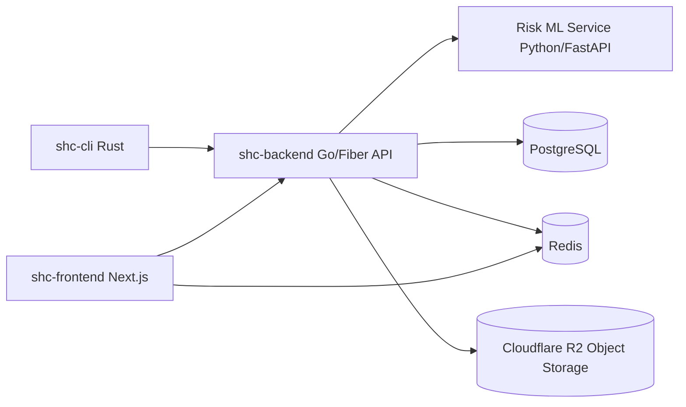

# 1. Project Title

## SHC Monorepo

SHC is a full-stack file sharing platform with three deliverables in one repository:

- `shc-backend`: Go API for authentication, file metadata, quotas, and storage URL generation
- `shc-frontend`: Next.js web app for browser-based file management
- `shc-cli`: Rust command-line tool for terminal-first file operations
- `shc-risk-ml-service`: Python ML microservice for risk scoring and threat explanations

---

# 2. Project Overview

SHC solves a common problem: securely sharing files from both a web interface and a command-line workflow while keeping infrastructure scalable and cost-aware.

Instead of proxying large uploads/downloads through the backend server, SHC uses presigned object-storage URLs. The backend focuses on authentication, authorization, quotas, and metadata, while object storage handles the heavy file transfer.

This design provides:

- Better scalability for large files
- Clear access control (owner/public visibility)
- Flexible usage across web and CLI clients
- Subscription-based usage limits for multi-tenant safety

---

# 3. Features

- OTP-based login flow (email verification)
- JWT access and refresh token authentication
- Session-aware token refresh/logout
- File upload initialization via presigned URLs
- File download via presigned URLs (with download count tracking)
- File visibility controls (public/private)
- File rename and delete operations
- Paginated and searchable file listing (web search includes autocomplete)
- Subscription plan limits (reads/writes/storage)
- Redis-backed caching and rate limiting
- Real-time risk scoring on shared-link access (`Low`, `Medium`, `High`)
- Browser UI (Next.js) and terminal UI/CLI (Rust)

### Current Web UI Notes

- Overview and sidebar are tuned for a compact layout.
- Files page uses a full-width compact list for uploaded files.
- Files page search supports autocomplete suggestions by file name.
- Language filter dropdown is removed from the web Files page.

---

# 4. Tech Stack

| Technology | Where Used | Why It Is Used |
| --- | --- | --- |
| Go | `shc-backend` | High-performance, compiled backend with simple deployment and strong concurrency support |
| Fiber v3 | `shc-backend` | Fast HTTP framework with middleware ecosystem for APIs |
| PostgreSQL | `shc-backend` | Relational source of truth for users, sessions, files, and subscriptions |
| GORM | `shc-backend` | ORM for model mapping and database operations in Go |
| Redis | `shc-backend`, `shc-frontend` | Caching, rate-limit storage, and key-value access patterns |
| AWS SDK v2 (S3 API) | `shc-backend` | Generates presigned URLs for Cloudflare R2 (S3-compatible storage) |
| Cloudflare R2 | `shc-backend` | Durable object storage for file content with S3-compatible API |
| JWT | `shc-backend`, clients | Stateless access token model for authenticated requests |
| Cron (`robfig/cron`) | `shc-backend` | Scheduled maintenance tasks (plan resets, cleanup flows) |
| Rust | `shc-cli` | Safe and fast CLI implementation with strong type guarantees |
| Clap | `shc-cli` | Command parsing and structured CLI UX |
| Reqwest + Tokio | `shc-cli` | Async HTTP client/runtime for API communication and file transfers |
| Next.js 14 | `shc-frontend` | Full-stack React framework with server actions and routing |
| React 18 | `shc-frontend` | Component-based UI for file management workflows |
| TypeScript | `shc-frontend` | Type-safe frontend/server-action development |
| Tailwind CSS | `shc-frontend` | Utility-first styling for consistent UI development |
| Node.js + npm | `shc-frontend` | Frontend toolchain/runtime for development and builds |
| Python + FastAPI | `shc-risk-ml-service` | ML inference API for malicious-content risk scoring |
| scikit-learn | `shc-risk-ml-service` | Structured + text model training/inference |

---

# 5. Project Architecture



High-level request flow:

- Clients authenticate via OTP and receive access/refresh tokens
- Backend validates auth, ownership, and quota rules
- Backend creates presigned upload/download URLs
- Clients transfer binary file data directly with object storage

---

# 6. Project Folder Structure

```text
.
├── shc-backend/
│   ├── cmd/                # App entrypoint, route registration, cron startup
│   ├── handlers/           # HTTP handlers (auth/files/user)
│   ├── middlewares/        # Fiber middleware (auth)
│   ├── models/             # GORM models
│   ├── services/           # Business logic + DB/Redis/S3/email integrations
│   └── utils/              # Helper functions (password/hash helpers)
├── shc-frontend/
│   ├── src/app/            # App Router pages/layouts
│   ├── src/components/     # Reusable UI components
│   ├── src/server-actions/ # Server-side actions for API workflows
│   ├── src/lib/            # Shared helpers (API client, date, KV)
│   └── src/types/          # Type definitions
└── shc-cli/
    ├── src/command/        # Command implementations (add/list/get/remove/...)
    ├── src/api_client.rs   # HTTP client logic and token refresh handling
    ├── src/cli.rs          # CLI command definitions
    └── src/user_config.rs  # Local config/token persistence
├── shc-risk-ml-service/
│   ├── app/                # FastAPI app and risk scoring engine
│   ├── training/           # Model training scripts
│   ├── data/               # Threat intel stubs and feedback data
│   └── models/             # Trained model artifacts
```

---

# 7. Installation Steps

## Prerequisites

- Git
- Go 1.21+
- Rust (stable toolchain + Cargo)
- Node.js 18+ and npm
- PostgreSQL
- Redis

## Clone repository

```bash
git clone <your-repo-url>
cd shc
```

## Create environment files

PowerShell (Windows):

```powershell
Copy-Item shc-backend/.env.example shc-backend/.env
Copy-Item shc-frontend/.env.example shc-frontend/.env
```

Bash (macOS/Linux):

```bash
cp shc-backend/.env.example shc-backend/.env
cp shc-frontend/.env.example shc-frontend/.env
```

## Install dependencies

```bash
# Backend
cd shc-backend
go mod download

# Frontend
cd ../shc-frontend
npm install

# CLI
cd ../shc-cli
cargo fetch
```

---

# 8. Environment Variables

## Backend (`shc-backend/.env`)

| Variable | Required | Purpose |
| --- | --- | --- |
| `PORT` | Yes | Backend server port (for example `3000`) |
| `JWT_SECRET_KEY` | Yes | Secret used to sign and verify JWT tokens |
| `DB_HOST` | Yes | PostgreSQL host |
| `DB_PORT` | Yes | PostgreSQL port |
| `DB_NAME` | Yes | PostgreSQL database name |
| `DB_USER` | Yes | PostgreSQL user |
| `DB_PASSWORD` | Yes | PostgreSQL password |
| `REDIS_URL` | Yes | Redis connection URL (for cache/rate limiting) |
| `R2_ACCOUNT_ID` | Yes | Cloudflare R2 account identifier |
| `R2_ACCESS_KEY_ID` | Yes | R2 access key ID |
| `R2_ACCESS_KEY_SECRET` | Yes | R2 secret key |
| `R2_REGION` | Yes | R2 region (usually `auto`) |
| `R2_BUCKET_NAME` | Yes | R2 bucket used for file storage |
| `R2_TOKEN` | Optional | Present in template, currently not consumed by backend code |
| `SMTP_HOST` | Yes | SMTP server host for OTP emails |
| `SMTP_PORT` | Yes | SMTP server port |
| `SMTP_TLS_MODE` | Optional | TLS mode: `starttls`, `tls`, or `none` |
| `SMTP_DIAL_TIMEOUT_SECONDS` | Optional | SMTP connection timeout in seconds |
| `SMTP_USER` | Yes | SMTP username |
| `SMTP_FROM_EMAIL` | Recommended | Sender email address |
| `SMTP_PASSWORD` | Recommended | SMTP password (generic providers) |
| `GOOGLE_APP_PASSWORD` | Optional | Gmail app password alternative |
| `SHC_DB_AUTO_MIGRATE` | Optional | If true, runs GORM auto-migration on startup |
| `SHC_DB_SEED_PLANS` | Optional | If true, seeds subscription plans (requires auto-migrate) |

### Required R2 CORS For Browser Uploads

If frontend upload shows CORS or preflight `403` for the presigned upload URL, configure your R2 bucket CORS.

Suggested CORS rule:

```json
[
	{
		"AllowedOrigins": [
			"http://localhost:3000"
		],
		"AllowedMethods": [
			"GET",
			"HEAD",
			"PUT"
		],
		"AllowedHeaders": [
			"*"
		],
		"ExposeHeaders": [
			"ETag",
			"Content-Length"
		],
		"MaxAgeSeconds": 3600
	}
]
```

Notes:

- Add your production frontend origin(s) to `AllowedOrigins`.
- Keep `PUT` enabled because uploads use presigned `PUT` URLs.
- `OPTIONS` is handled by the storage service based on this CORS policy.

## Frontend (`shc-frontend/.env`)

| Variable | Required | Purpose |
| --- | --- | --- |
| `SHC_BACKEND_API_BASE_URL` | Yes | Backend base URL used by server actions/fetch wrappers |
| `REDIS_URL` | Recommended | Redis URL used by `src/lib/kv.ts` |
| `KV_URL` | Optional | Included in template for KV integrations |
| `KV_REST_API_URL` | Optional | Included in template for KV integrations |
| `KV_REST_API_TOKEN` | Optional | Included in template for KV integrations |
| `KV_REST_API_READ_ONLY_TOKEN` | Optional | Included in template for KV integrations |
| `UPSTASH_REDIS_URL` | Optional | Included in template for Upstash setups |
| `UPSTASH_REDIS_TOKEN` | Optional | Included in template for Upstash setups |
| `NEXT_PUBLIC_BASE_URL` | Optional | Public app base URL |

## CLI (optional runtime override)

| Variable | Required | Purpose |
| --- | --- | --- |
| `SHC_BACKEND_API_BASE_URL` | Optional | Override backend URL for `shc-cli` during local/testing runs |

---

# 9. How to Run the Project

Use separate terminals.

## 1) Start backend

```bash
cd shc-backend
go run ./cmd
```

Alternative on Windows (from `shc-backend`):

```bash
npm run dev
```

## 2) Start frontend

```bash
cd shc-frontend
npm run dev
```

Frontend default URL: `http://localhost:3000`

## 3) Run CLI

```bash
cd shc-cli
cargo run -- --help
```

Common CLI commands:

```bash
cargo run -- login
cargo run -- add <FILE>
cargo run -- list
cargo run -- get <FILTER>
cargo run -- remove <FILTER>
cargo run -- rename <FILTER>
cargo run -- visibility <FILTER>
cargo run -- logout
```

Windows note for GNU Rust toolchain environments:

- If linker/toolchain errors appear, use `cargo +stable-x86_64-pc-windows-gnu ...` with a working GNU toolchain in `PATH`.

---

# 10. Running with Docker (if applicable)

This repository currently does not include `Dockerfile` or `docker-compose.yml` for full-containerized app startup.

Practical Docker usage today:

- Run infrastructure dependencies (PostgreSQL, Redis) in Docker
- Run `shc-backend`, `shc-frontend`, and `shc-cli` natively

If you want full Docker support, add service Dockerfiles plus a compose file as a future enhancement.

---

# 11. API Endpoints (Backend)

Base URL: `http://localhost:<PORT>`

Auth notes:

- Protected routes use access token in `Authorization: Bearer <token>`
- Refresh route uses refresh token

## Health

| Method | Endpoint | Auth | Description |
| --- | --- | --- | --- |
| `GET` | `/` | No | Health check |

## Authentication

| Method | Endpoint | Auth | Description |
| --- | --- | --- | --- |
| `POST` | `/auth/otp` | No | Generate and send OTP to email |
| `POST` | `/auth/login` | No | Verify OTP and return access/refresh tokens |
| `GET` | `/auth/refresh-token` | Refresh token | Issue a new token pair |
| `DELETE` | `/auth/logout` | Access token | Invalidate current session |

## User

| Method | Endpoint | Auth | Description |
| --- | --- | --- | --- |
| `GET` | `/api/users/me` | Access token | Get current user profile and subscription |

## Files

| Method | Endpoint | Auth | Description |
| --- | --- | --- | --- |
| `GET` | `/api/files/` | Access token | List files (supports pagination/search via query params) |
| `GET` | `/api/files/:fileId` | Access token | Get file metadata/download URL |
| `POST` | `/api/files/add` | Access token | Create file record and get upload URL |
| `PATCH` | `/api/files/update-upload-status/:fileId` | Access token | Update upload status |
| `PATCH` | `/api/files/toggle-visibility/:fileId` | Access token | Toggle file visibility |
| `PATCH` | `/api/files/increment-download-count/:fileId` | Access token | Increment file download count |
| `PATCH` | `/api/files/rename/:id` | Access token | Rename file |
| `DELETE` | `/api/files/remove/:id` | Access token | Delete file |

---

# 12. Future Improvements

- Add OpenAPI/Swagger documentation for backend endpoints
- Add automated unit/integration tests across all modules
- Add first-class Docker and Docker Compose support
- Add CI/CD pipeline (lint, test, build, release)
- Improve OTP reliability and operational observability
- Add resumable uploads/downloads in CLI and web
- Publish prebuilt CLI binaries for major platforms

---

# 13. Contributing Guidelines

1. Fork the repository.
2. Create a branch: `git checkout -b feat/your-feature-name`.
3. Keep changes focused and include tests when possible.
4. Update docs if behavior or configuration changes.
5. Run checks/build locally for affected module(s).
6. Open a pull request that clearly explains what changed, why it changed, and how it was tested.

Recommended commit style:

- `feat: add xyz`
- `fix: correct abc`
- `docs: update setup steps`

